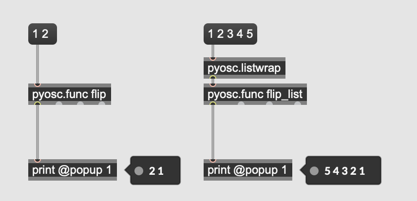
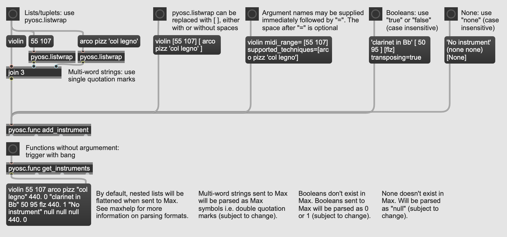

# MaxOsc

Library to call python code from MaxMSP over OSC. 

Use in combination with the pyosc package in MaxMSP.

Further documentation will be available later.

### Minimal Example
##### Python Code:
```python
from maxosc import MaxOsc

class Flipper(MaxOsc):

    def __init__(self):
        super().__init__()
        self.run()

    def flip(self, a1: int, a2: int):
        return a2, a1

    def flip_list(self, a: [int]):
        return list(reversed(a))

if __name__ == '__main__':
    Flipper()

```

##### Max Code:


<details><summary>Show code</summary>

```
<pre><code>
----------begin_max5_patcher----------
432.3ocwU9saBBCEF+Z3onoWyL.BLcWs2ikESEqtZv1l1hhw369n+AmNItlg
QuvZ5omxW+w2oGNDF.myZvRH3MvGfffCgAAlP5.At4AvMnlxJjzjFjh2wluF
FYWRgaTlv78LY4nJhTsSf3cKSq2vpUUXkYuItnjElsz9XdI40tTs4o1yw1SC
DB9zsDGoJ+hPWMSfKU1UGmlNJNBLMWONISOpibZKsBSnmzUG6XXndHZfXJHT
E3cNiWyAI8iYbOXV.+SVRiiMHkb+gYCVJQqvWQSBHELFjAx82uxGjeUXPLO+
1Hl978q3a3WIYOQ+xamZ5+ynbvYMpzoixeTFko+wxZZIXYEgOS2IoeVytl0a
zDI5redTfl39Kt3w0R4Rx8F5hgCsyrcPOI2elMY.qHze+wCiJ53W9hPxpEkc
mutF+feDZAVpHTjhvnmkjKmdeW6sP4dHTx8PIeHR+gfAKTgOBEeGDZpGBcMP
1ZCDmuEKjtjMRzdcXMSnmNIxLkPsSMsufB7VRW91HHQaEqpsbsVXNVvlhLnc
qrEXAsl3pKagqURyUMJps6IGY4vbiL7X32.J7svT
-----------end_max5_patcher-----------
</code></pre>
```
</details>


### Elaborate Example
##### Python Code:
```python
from maxosc import MaxOsc


class Instrument:
    def __init__(self, name: str, midi_range: (int, int), supported_techniques: [str], concert_pitch: float,
                 transposing: bool):
        self.name: str = name
        self.midi_range: (int, int) = midi_range
        self.supported_techniques: [str] = supported_techniques
        self.concert_pitch: float = concert_pitch
        self.transposing: bool = transposing

    def max_getter(self):
        return self.name, self.midi_range, self.supported_techniques, self.concert_pitch, self.transposing


class InstrumentBank(MaxOsc):
    def __init__(self):
        super().__init__()
        self.instruments: [Instrument] = []
        self.run()

    def add_instrument(self, name: str, midi_range: (int, int), supported_techniques: [str],
                       concert_pitch: float = 440.0, transposing: bool = False):
        instrument = Instrument(name, midi_range, supported_techniques, concert_pitch, transposing)
        self.instruments.append(instrument)
        print(f"Added instrument '{name}' with range={midi_range}, techniques={supported_techniques}, "
              f"concert pitch={concert_pitch} and transposing={transposing}.")

    def get_instruments(self):
        return [instr.max_getter() for instr in self.instruments]


if __name__ == '__main__':
    InstrumentBank()

```

##### Max Code:

<details><summary>Show code</summary>
<pre><code>
----------begin_max5_patcher----------
1437.3ocyZ0zbaaCD8r7uBL7hSlQUkfeyLiOzbnmZyk1a1d7.QAIiTH.FBP+
Qxj+6YA.kLssDMqHkRlwlhDBB69d.6tO.ouc1Du4xGnJOzGPWhlL4amMYhsI
SCSZddh2ZxCEbhx1MuB450Tg1ap68zzGz11+3inEzkjZtdJRPUZ5BDmozJz8
LNGMmhVxIZMUPWLC8OTJBFzao7RzRYEZsrhhXB310DMSJPvekjJESrB4ZTMa
iA4LAsPVKrVMroQQ8ZYslS0VezuoU1BqmIm+4eKKcymujnKtEF3apnEZGvw4
Iy7mhBS8mEOEgSyMOEkNyGc8SiOSrY3wl199YmYtLcfr1mjB5GP0JJ5JOAb+
Udn2UPTF1PQEJllcG88CD5wc.8rHGzyMHOM8zA7OJkbJQn1.dcUsA7vhgq7V
R3piBSD1ASjhCdhIv93SGU7GUqpMuARPVSUPfwilvEUcYImAQQL3SsfQzT9i
Pv.mKuGZb9i.OcwUdyP+6sPeKIETDYolV4ZFwTHYoIThvGHmg6fyhx8awY4m
PN6ufTK2WQJQEDggspnkbfCV.Yaz2Bd10SQT3NfOrMHcuBP0wUpgQJo4cPJg
A4sHkP+SKon9cccoYvcAVkOJUEy3Mr0NQcPuQcW4PShaG83RpDdJ.8eCUbX2
KqVfT5JvmZ.to1Amh9RsT6JorlT8epAR.ckIEGEXwtKgJ1.9wlBlWq0Rg2Nc
W7Nb2Vo6pfTKP1ganBxbNsM9big9wRpCGdyIhUdac5cUyHnUTePj4dy0ed3L
33fyjr3esvI93fynjnesvo+wAmA4YFDd7v49RQ8m0hBSNH01hPDaIeSm+.Bx
ZsZ0lBUVPLnjTIYckk1pvKHyJ0A6d4mZNpjjiybcXRKfdLlqAkZJxJ5qlqO+
SRihUPNqY18bz6Lp5QlKuGcoQs+0cJ8nrhBpcckrtoGK.1EkF4sOZqOo0ysT
ViVt78QYAiIkAcApbS0.wg937yAeI1GkGitFc4R9WuFhPfMJTJMkzuvrOgiN
CFdXLXSACGChw9mNJ7NlDfJZMaA6FfrVQu.cYbLHDK8Z6FIjUv9wuQSKtUv9
RMUcwkjpBIpj80uhNuPxQb5Jg77CcsYXuYV7gwrMknZX133SNy5HSzSr1Uda
oMX6VQQ9yP9lFe1RY3cbqjgkwt9fg97rLDPWD0bdqKtwZmyDw8kmi8OLd1k1
LL1ogM1R2oIiIOKn2CN3qnY29TVBEJQqn5adheT6tTRzqwbT79w7zV+2C7iy
ZsNKH3TT2Xmwi8tLZTvgMeiSBMhgbaiG6NAj8i2wLtxEP0e.dfKnSsSnN7EE
e5fmKsQugWX1PhWaNEljwGd+OUyEdTUyc7Dt2YRoWd3IuMKDMnfQrK6SVz3m
7YO37yRnZUX+wWvPVr1b.I44cCuve9Si3gjx4HNK9FRU1J76Pz38lrRvAt3t
Yy2tTUYYiu.t2VXAYwhVBK5sthjwRVQPTdKYU8aMgsG1opW7kzYsho8mSIJY
cUwF+ayg.hdxPKnJMSXkv2pSlsLZ5zNo8daof9XovwvR39XI7XXI+dXofwf8
LGDxaZIiD2gaon9vdOqOv9JKgZDZ0lSJvUINH07BHqZyCC0yBGpmkjG4bl71
dV9f8rMDemdlYSWvF71iq4blvnT22wb11mFJogGJoEkF53or1jV1f8rv93YF
wDFRaXSO8ILMbLRHD0mjbgiQBgvn9xdAC0RACdEz1.M+1QcClBx5KELXK0qr
uAuMGzbx5o1u8ur1k3kUKnU1sAcB7T+95oYau+0NJ936nuXFtCGMpCGMXPNZ
vfqGF5m4Tz045emTNRY4czJUynacJPG6mkVfjM09HS3dzJ+1qhdGaS+cs.55
ukoA0k0UVf38PyY96sVBThnl0L8AzAXRqFY6usDyO8A295Aozm88y9APrzsf
1
-----------end_max5_patcher-----------
</code></pre>
</details>